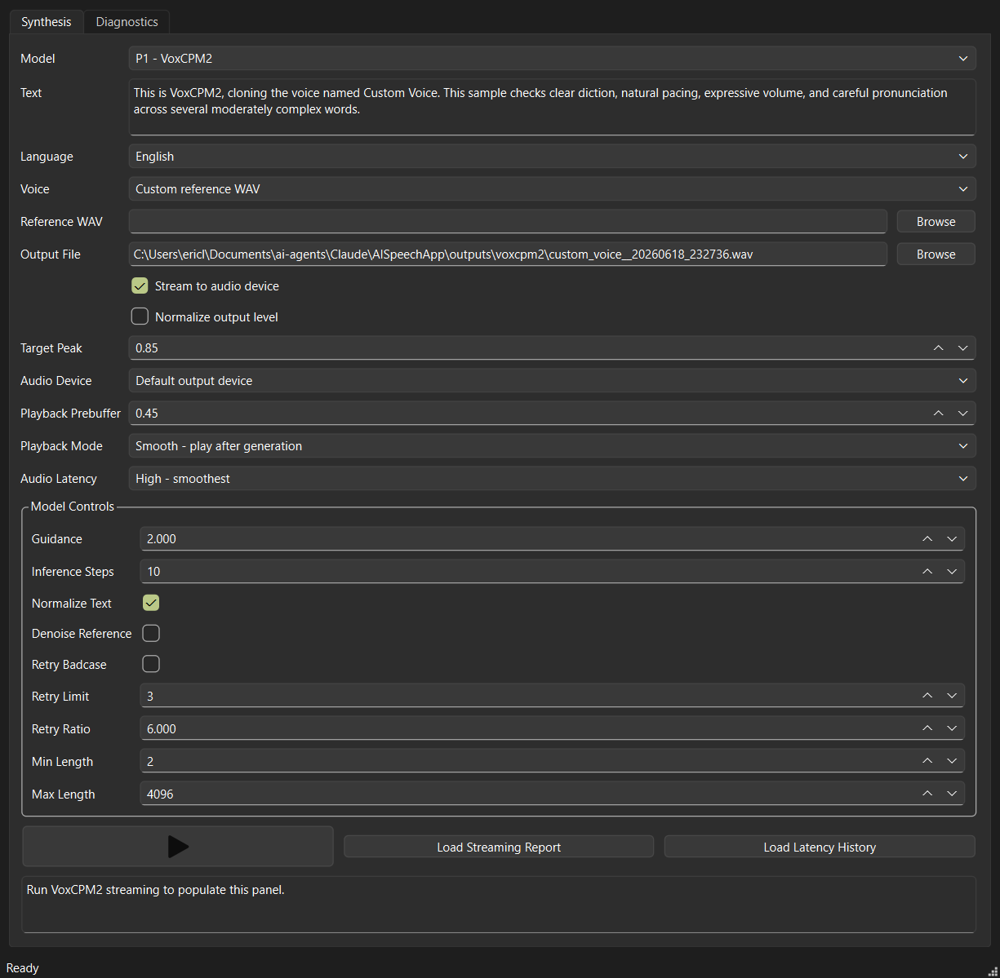

# AISpeechApp

Local-only TTS comparison lab for OmniChat's future speech-output layer.

The first milestone is a native desktop comparison tool with diagnostics behind
the main synthesis workflow. It answers:

- Can the model install locally?
- Can it load on this machine?
- Can it synthesize a short sentence?
- Can it clone or condition from a reference voice?
- What are the rough latency, VRAM, sample-rate, and output-quality notes?

The project intentionally lives outside OmniChat so model-specific packages,
CUDA quirks, generated WAV files, and heavyweight experiments do not destabilize
the assistant app.

## Updates

### 2026-06-19

- VoxCPM2 model variants now start and prepare as distinct candidates. Switching
  between baseline, CPU dynamic int8, TorchAO int8, and BNB int8 evicts the
  prior prepared model instead of reusing an anonymous warmed object. Repeating
  the same selected candidate can still reuse its prepared model during the GUI
  session.
- Torch compile remains available as an experimental VoxCPM2 option, but compile
  runs are isolated and uncached because repeated compiled generations have
  shown corruption in local testing.
- Added BNB int8 and TorchAO int8 VoxCPM2 candidates for side-by-side quality,
  latency, and dropout comparisons. Early local testing shows BNB works but is
  slower than the stable baseline/CPU-quant path on this machine.
- The VoxCPM2 GUI path records quantization method, quantization targets,
  quantization status, seed, torch compile status, time to first output, and
  playback settings into each generation sidecar.

### 2026-06-18

- Restored stable VoxCPM2 audio playback by removing the realtime visualization
  work from the live streaming path. The GUI now favors smooth audio and
  deterministic diagnostics over drawing waveforms during playback.
- Added per-model output directories under `outputs\<model-slug>` and JSON
  sidecars next to generated WAV/MP3 files, making comparison runs easier to
  inspect and archive.
- Reworked the Diagnostics smoke display into a native sortable table with
  candidate capabilities, model scale, cache/import readiness, GUI availability,
  and report age.
- Captured README screenshots for the synthesis workflow, latency history, and
  smoke/capability table.
- Added app-borne desktop probes and audio gap analysis utilities so GUI
  workflows, voice selection, generated files, and timing/dropout evidence can
  be tested without relying on manual GUI-only checks.

### 2026-06-17

- Built the first native PySide6 AISpeechApp comparison GUI as a sibling project
  to OmniChat.
- Integrated the first runnable local TTS candidates, with VoxCPM2 established
  as the strongest voice-cloning baseline in local listening tests.
- Added metadata-driven generation controls so model-specific knobs can be
  declared in `configs\candidates.json` and surfaced only when supported by the
  selected backend.

## Candidate Tiers

Initial high-priority candidates:

| Candidate | Repo | Why it matters |
| --- | --- | --- |
| Qwen3-TTS CustomVoice | `Qwen/Qwen3-TTS-12Hz-1.7B-CustomVoice` | Strong current local baseline for voice cloning and voice design. |
| VoxCPM2 | `openbmb/VoxCPM2` | 2B, 48 kHz, multilingual, controllable voice cloning. |
| IndexTTS2 | `IndexTeam/IndexTTS-2` | Expressive zero-shot cloning with duration/emotion control. |
| Fish Speech S2 Pro | `fishaudio/s2-pro` | High-end expressive/cloning comparison point. |
| OmniVoice | `k2-fsa/OmniVoice` | New multilingual zero-shot cloning and voice design candidate. |
| VibeVoice 1.5B | `microsoft/VibeVoice-1.5B` | Long-form multi-speaker TTS candidate; current backend uses native VibeVoice inference with reference-WAV cloning. |
| MOSS-TTS v1.5 | `OpenMOSS-Team/MOSS-TTS-v1.5` | Newer long-form/cloning candidate with pronunciation control claims. |

Watch-list candidates:

- `bosonai/higgs-audio-v3-tts-4b`
- `Zyphra/ZONOS2`
- `rednote-hilab/dots.tts-soar`
- `Supertone/supertonic-3`
- `LongCat-AudioDiT-3.5B` derived/checkpoint mirrors

## Quick Start

```powershell
cd C:\Users\ericl\Documents\ai-agents\Claude\AISpeechApp
.\scripts\bootstrap.ps1
.\.venv\Scripts\python.exe -m aispeechapp.smoke --list
.\.venv\Scripts\python.exe -m aispeechapp.smoke --all --metadata-only
```

On this workstation, the Windows `py -3.11` launcher is not registered, so the
bootstrap script prefers the uv-managed CPython 3.11/3.12 runtimes under
`%APPDATA%\uv\python`.

For development after bootstrap:

```powershell
.\.venv\Scripts\python.exe -m pip install -e ".[dev,gui,metrics]"
.\.venv\Scripts\python.exe -m pytest -q
.\.venv\Scripts\python.exe -m ruff check .
```

The desktop GUI uses the same framework style as OmniChat RT: native PySide6,
a `QMainWindow` shell, injectable backends for tests, and an app-borne demo
probe that drives the real window and saves screenshots plus a JSON report.

## GUI Screenshots

Synthesis overview with model, voice, output, playback, and model controls:



Synthesis tab with VoxCPM2 voice cloning controls:


Latency history view:


Diagnostics tab with the sortable smoke/capability table:


```powershell
.\launch.bat
```

Run the deterministic visible demo backend:

```powershell
.\launch_demo.bat
```

Run the app-borne desktop probe:

```powershell
.\run_desktop_probe.bat
```

The probe exercises the actual PySide6 window, captures screenshots, runs a
small two-prompt/two-voice streaming matrix, verifies that each selected voice
produces a distinct WAV artifact, and writes
`outputs\desktop_demo\desktop_demo_probe.json`.

The Diagnostics tab shows the latest smoke report as a native sortable table,
including model scale, cloning/streaming/language capabilities, audio rate,
local import/cache status, and a report-age label. Rows highlighted in green are
available from the Synthesis tab.

The synthesis tab keeps VoxCPM2 in-process for the GUI session, so the first
real streaming generation may still pay model load time but later generations
reuse the loaded model. VoxCPM2 live playback uses the direct PortAudio write
path with no GUI visualizer or audio-observer thread. This intentionally favors
stable audio over GUI responsiveness during live streaming.

Playback controls expose `0.45s` prebuffer, PortAudio latency, and a choice
between `Smooth - play after generation` and `Live stream - lowest latency`.
Use live mode when judging streaming latency. If the model produces chunks
slower than their audio duration, true live device playback can still underrun.

VoxCPM2 streaming also includes optional smoothed peak normalization for the
saved WAV and live playback path. It defaults off so baseline comparisons keep
the model's raw output, and can be enabled from the GUI with a `0.85` target
peak when level matching samples.

Non-streaming backend synthesis runs on a background Qt worker thread. VoxCPM2
live streaming runs on the simple direct path so playback timing is not coupled
to GUI visualization or timer work.

Generated WAVs and VoxCPM2 timing reports can be checked for dropout evidence:

```powershell
.\.venv\Scripts\python.exe -m aispeechapp.audio_gap_analysis `
  --wav outputs\voxcpm2_streaming\gap_fix_probe.wav `
  --timing-report reports\gap_fix_probe.json `
  --output reports\gap_fix_probe_audio_scan.json
```

The WAV scan ignores normal leading/trailing quiet and flags internal silent
holes. The timing scan flags live-playback underrun risk only for live/legacy
runs; smooth after-generation playback can still report slow chunk timing
without producing choppy device audio.

GUI generations are organized by model under `outputs\<model-slug>`. The default
filename uses the cloned voice name plus a timestamp, for example
`outputs\vibevoice_1_5b\eric_snyder__20260618_213045.wav`. Each GUI-triggered
generation also writes a JSON sidecar next to the audio file, such as
`eric_snyder__20260618_213045.wav.json`, recording the model, voice, reference
WAV, prompt text, language, exposed knob values, playback settings, status, and
timing details. The shared `time_to_first_output_s` metric is recorded for both
streaming and file-based runs: streaming maps it to first emitted audio chunk
latency, while WAV/MP3 backend runs measure when the output file first appears
with nonzero size.

Model-specific generation controls are declared in
`configs\candidates.json` under each candidate's `generation_parameters` list.
The GUI reads that metadata when a model is selected and shows only controls the
selected backend currently supports. VoxCPM2 exposes guidance, inference steps,
text normalization, denoise, retry, and min/max generation length controls;
Qwen3-TTS exposes speaker/max-token controls; dots.tts exposes steps and
guidance; VibeVoice 1.5B exposes CFG scale, DDPM steps, voice-clone prefill,
and seed controls.

VoxCPM2 also has an experimental `Torch Compile` control. It defaults off to
protect the stable live-audio path. When enabled, AISpeechApp attempts a
conservative `torch.compile` pass over compilable VoxCPM2 `torch.nn.Module`
members and records `torch_compile_status` in the generation report/sidecar.
On Windows this may report unavailable or not applicable, especially when Triton
or a supported compile backend is missing.

Your current per-model knob values are saved in
`configs\gui_settings.local.json`. That file is intentionally git-ignored:
`configs\candidates.json` remains the shared default/schema file, while the
local settings file preserves your last selected model and each model's current
control values across GUI restarts.

## Batch Backend Outputs

The backend synthesis helper supports non-streaming file generation for the
batch candidates exposed by the GUI, including OmniVoice and VibeVoice 1.5B:

```powershell
.\.venv\Scripts\python.exe .\scripts\synthesize_backend.py `
  --candidate omnivoice `
  --text "OmniVoice first impression sample." `
  --language-code en `
  --language-hint English `
  --output outputs\omnivoice_sample.wav

.\.venv\Scripts\python.exe .\scripts\synthesize_backend.py `
  --candidate microsoft_vibevoice_15b `
  --text "Speaker 1: VibeVoice first impression sample." `
  --language-code en `
  --language-hint English `
  --reference-wav-path voice_refs\first_impression.wav `
  --output outputs\vibevoice_sample.wav `
  --options-json '{\"cfg_scale\":1.3,\"ddpm_steps\":10,\"seed\":1}'
```

Use `.wav` for direct PCM output or `.mp3` for FFmpeg-backed MP3 encoding.
OmniVoice expects `voice_refs\first_impression.wav` and
`voice_refs\first_impression.txt` for zero-shot cloning. VibeVoice 1.5B expects
`voice_refs\first_impression.wav` and uses the native VibeVoice inference code,
not the generic Hugging Face `text-to-speech` pipeline. The generic pipeline does
not currently expose AISpeechApp's reference-WAV cloning path in this environment.
Install the runtime code with:

```powershell
.\.venv\Scripts\python.exe -m pip install diffusers ml-collections peft av aiortc
.\.venv\Scripts\python.exe -m pip install --no-deps git+https://github.com/vibevoice-community/VibeVoice.git
```

Use `--no-deps` for the VibeVoice source install because its package metadata
pins older shared libraries that can disturb the other AISpeechApp backends.
The model weights are cached under `D:\AI\Models\huggingface` by AISpeechApp's
cache configuration.

## Repository Policy

- Use the local `.venv` only.
- Keep model weights/caches on the large model disk, not the system drive.
- Do not commit generated audio, probe-output screenshots, reports, local voice samples, or model weights.
- Curated documentation screenshots belong under `docs\images`.
- Keep the GUI native PySide6, matching OmniChat RT's desktop architecture.
- Preserve app-borne demo tests for visible GUI workflows.

## Smoke Levels

| Level | Meaning |
| --- | --- |
| `metadata` | Query Hugging Face metadata and confirm the candidate exists. |
| `import` | Confirm declared Python packages can be imported. |
| `cache` | Confirm the model is already available locally or report download need. |
| `synthesis` | Generate one short neutral WAV. |
| `clone` | Generate one short WAV using a reference voice. |

Metadata and import/cache readiness are implemented across the catalog.
Backend-specific synthesis is now present for VoxCPM2, Qwen3-TTS, dots.tts,
IndexTTS2, OmniVoice, and VibeVoice 1.5B, with actual runtime availability
depending on each package and model cache.
