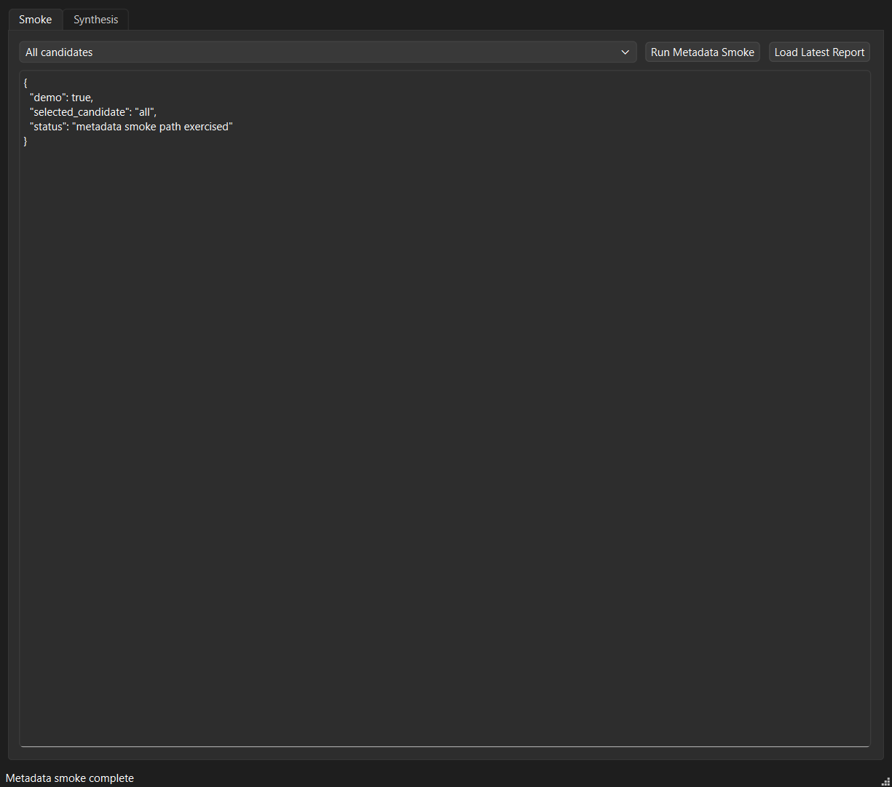
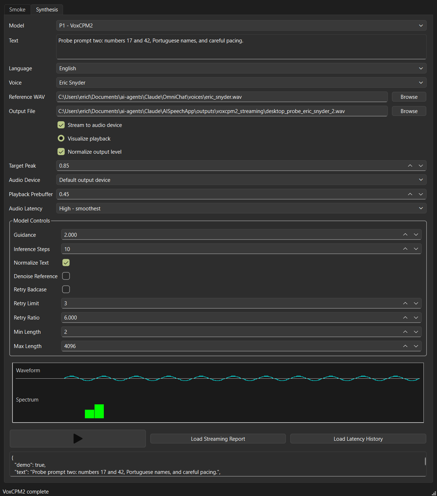
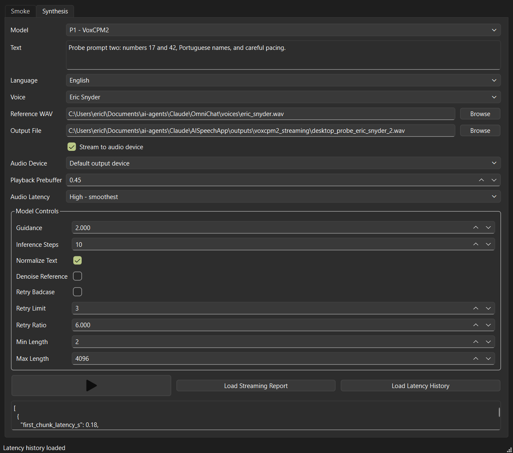

# AISpeechApp

Local-only TTS comparison lab for OmniChat's future speech-output layer.

The first milestone is not a polished benchmark. It is a smoke-test harness that
answers:

- Can the model install locally?
- Can it load on this machine?
- Can it synthesize a short sentence?
- Can it clone or condition from a reference voice?
- What are the rough latency, VRAM, sample-rate, and output-quality notes?

The project intentionally lives outside OmniChat so model-specific packages,
CUDA quirks, generated WAV files, and heavyweight experiments do not destabilize
the assistant app.

## Candidate Tiers

Initial high-priority candidates:

| Candidate | Repo | Why it matters |
| --- | --- | --- |
| Qwen3-TTS CustomVoice | `Qwen/Qwen3-TTS-12Hz-1.7B-CustomVoice` | Strong current local baseline for voice cloning and voice design. |
| VoxCPM2 | `openbmb/VoxCPM2` | 2B, 48 kHz, multilingual, controllable voice cloning. |
| IndexTTS2 | `IndexTeam/IndexTTS-2` | Expressive zero-shot cloning with duration/emotion control. |
| Fish Speech S2 Pro | `fishaudio/s2-pro` | High-end expressive/cloning comparison point. |
| OmniVoice | `k2-fsa/OmniVoice` | New multilingual zero-shot cloning and voice design candidate. |
| VibeVoice 1.5B | `microsoft/VibeVoice-1.5B` | Long-form multi-speaker TTS candidate; current backend uses the Transformers TTS pipeline. |
| MOSS-TTS v1.5 | `OpenMOSS-Team/MOSS-TTS-v1.5` | Newer long-form/cloning candidate with pronunciation control claims. |

Watch-list candidates:

- `bosonai/higgs-audio-v3-tts-4b`
- `Zyphra/ZONOS2`
- `rednote-hilab/dots.tts-soar`
- `Supertone/supertonic-3`
- `LongCat-AudioDiT-3.5B` derived/checkpoint mirrors

## Quick Start

```powershell
cd C:\Users\ericl\Documents\ai-agents\Claude\AISpeechApp
.\scripts\bootstrap.ps1
.\.venv\Scripts\python.exe -m aispeechapp.smoke --list
.\.venv\Scripts\python.exe -m aispeechapp.smoke --all --metadata-only
```

On this workstation, the Windows `py -3.11` launcher is not registered, so the
bootstrap script prefers the uv-managed CPython 3.11/3.12 runtimes under
`%APPDATA%\uv\python`.

For development after bootstrap:

```powershell
.\.venv\Scripts\python.exe -m pip install -e ".[dev,gui,metrics]"
.\.venv\Scripts\python.exe -m pytest -q
.\.venv\Scripts\python.exe -m ruff check .
```

The desktop GUI uses the same framework style as OmniChat RT: native PySide6,
a `QMainWindow` shell, injectable backends for tests, and an app-borne demo
probe that drives the real window and saves screenshots plus a JSON report.

## GUI Screenshots

Metadata smoke tab:



Synthesis tab with VoxCPM2 voice cloning controls and live audio visualization:



Latency history view:



```powershell
.\launch.bat
```

Run the deterministic visible demo backend:

```powershell
.\launch_demo.bat
```

Run the app-borne desktop probe:

```powershell
.\run_desktop_probe.bat
```

The probe exercises the actual PySide6 window, captures screenshots, runs a
small two-prompt/two-voice streaming matrix, verifies that each selected voice
produces a distinct WAV artifact, and writes
`outputs\desktop_demo\desktop_demo_probe.json`.

The synthesis tab keeps VoxCPM2 in-process for the GUI session, so the first
real streaming generation may still pay model load time but later generations
reuse the loaded model. Playback defaults favor smooth output: `0.45s`
prebuffer and high PortAudio latency. Lower those controls only when tuning for
minimum start latency.

During streaming playback, the GUI renders a realtime waveform and compact
speech-band frequency histogram from the same audio chunks that are written to
disk and sent to the selected output device. The waveform is scaled so
full-level audio fills the available height, while the spectrum groups energy
into log-spaced speech-range bands instead of raw FFT bins.
The `Visualize playback` radio control can be toggled during playback to
disable or re-enable visualizer updates without changing audio generation.

VoxCPM2 streaming also includes optional smoothed peak normalization for the
saved WAV and live playback path. It defaults on with a `0.85` target peak and
can be disabled from the GUI when judging the raw model output.

Generation runs on a background Qt worker thread, so model loading and synthesis
do not block the native GUI event loop while the run is in progress.

Model-specific generation controls are declared in
`configs\candidates.json` under each candidate's `generation_parameters` list.
The GUI reads that metadata when a model is selected and shows only controls the
selected backend currently supports. VoxCPM2 exposes guidance, inference steps,
text normalization, denoise, retry, and min/max generation length controls;
Qwen3-TTS exposes speaker/max-token controls; dots.tts exposes steps and
guidance.

Your current per-model knob values are saved in
`configs\gui_settings.local.json`. That file is intentionally git-ignored:
`configs\candidates.json` remains the shared default/schema file, while the
local settings file preserves your last selected model and each model's current
control values across GUI restarts.

## Batch Backend Outputs

The backend synthesis helper supports non-streaming file generation for the
batch candidates exposed by the GUI, including OmniVoice and VibeVoice 1.5B:

```powershell
.\.venv\Scripts\python.exe .\scripts\synthesize_backend.py `
  --candidate omnivoice `
  --text "OmniVoice first impression sample." `
  --language-code en `
  --language-hint English `
  --output outputs\omnivoice_sample.wav

.\.venv\Scripts\python.exe .\scripts\synthesize_backend.py `
  --candidate microsoft_vibevoice_15b `
  --text "VibeVoice first impression sample." `
  --language-code en `
  --language-hint English `
  --output outputs\vibevoice_sample.mp3
```

Use `.wav` for direct PCM output or `.mp3` for FFmpeg-backed MP3 encoding.
OmniVoice expects `voice_refs\first_impression.wav` and
`voice_refs\first_impression.txt` for zero-shot cloning. VibeVoice 1.5B is
currently wired through the Hugging Face `text-to-speech` pipeline; arbitrary
reference-WAV cloning remains unverified until that API exposes a stable hook.

## Repository Policy

- Use the local `.venv` only.
- Keep model weights/caches on the large model disk, not the system drive.
- Do not commit generated audio, probe-output screenshots, reports, local voice samples, or model weights.
- Curated documentation screenshots belong under `docs\images`.
- Keep the GUI native PySide6, matching OmniChat RT's desktop architecture.
- Preserve app-borne demo tests for visible GUI workflows.

## Smoke Levels

| Level | Meaning |
| --- | --- |
| `metadata` | Query Hugging Face metadata and confirm the candidate exists. |
| `import` | Confirm declared Python packages can be imported. |
| `cache` | Confirm the model is already available locally or report download need. |
| `synthesis` | Generate one short neutral WAV. |
| `clone` | Generate one short WAV using a reference voice. |

Metadata and import/cache readiness are implemented across the catalog.
Backend-specific synthesis is now present for VoxCPM2, Qwen3-TTS, dots.tts,
IndexTTS2, OmniVoice, and VibeVoice 1.5B, with actual runtime availability
depending on each package and model cache.
